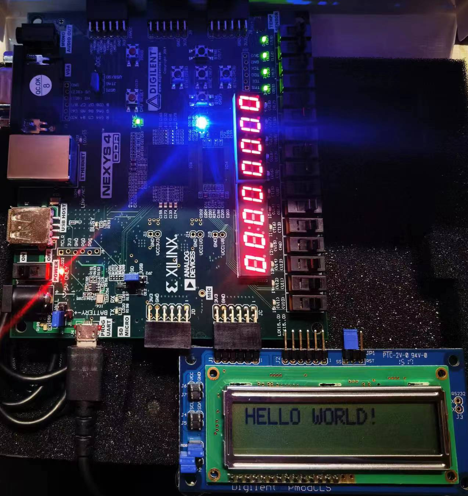
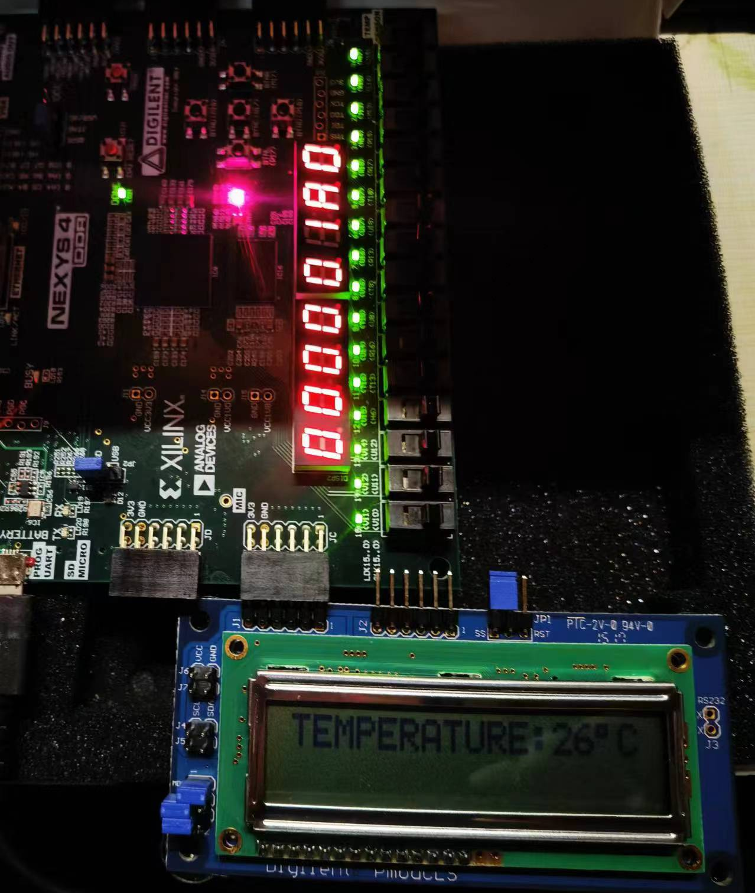

# HUST 接口技术综合实验

## 简易温度报警器

基于 ADT7420 温度传感器，搭配 PmodCLS LCD 屏，在 Nexys ddr 4 开发板上实现的简易温度测量和报警装置。

## 文件目录

- FinalLAB.xpr 是 Vivado 项目文件，可以使用 Vivado 打开
- Bitstream 文件位于 FinalLAB.runs\impl_1 中，名为 rvfpga.bit
- FinalLab 文件夹中是 vscode-platformIO 项目，可使用安装了platformIO 插件的 vscode打开
- FinalLAB\FinalLab\src 文件夹中是项目实现的C语言代码，其中 FinalLab.c 是主程序所在文件

## 实现效果

- 打开 platformio.ini 文件，对比特流文件地址、波特率进行设置
- 连接开发板，将 PmodCLS LCD 屏插入 JC 接口的下六个接口中
- 使用 platformIO 插件的 Upload Bitstream 功能将比特流文件烧录至开发板
- 在 vscode 中运行程序
- LCD屏上会显示当前温度，当温度高于程序中设定的 alarmTemp 时，状态LED由蓝转红，16个LED闪烁报警

    

    

